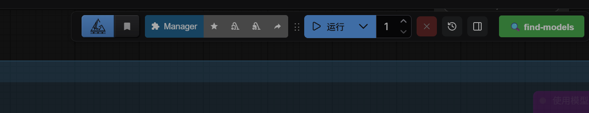
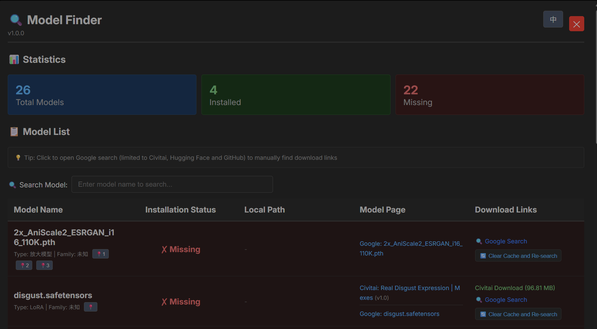
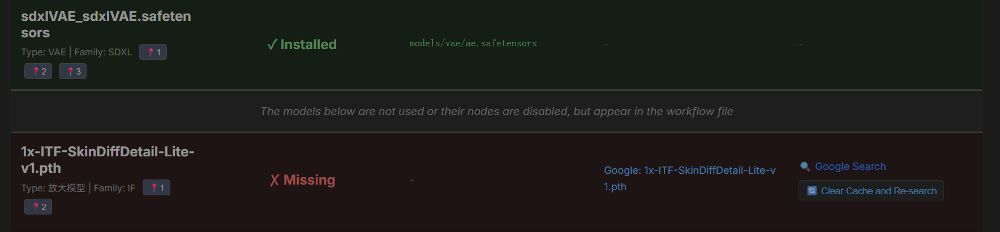

# ComfyUI Find Models

This tool detects the models required by your workflow in the ComfyUI interface and provides similar download results from civitai.com/models and huggingface.co, or Google search results.

**Current Version: v1.0.0**

> This is the toolbar interface

> Pop-up window interface

> Installed interface

## Installation

1. Copy the `comfyUI-find-models` folder to the `custom_nodes` directory of ComfyUI.
2. Restart ComfyUI.

## Changelog

### v1.0.0 (2026-01-10)
- Initial release